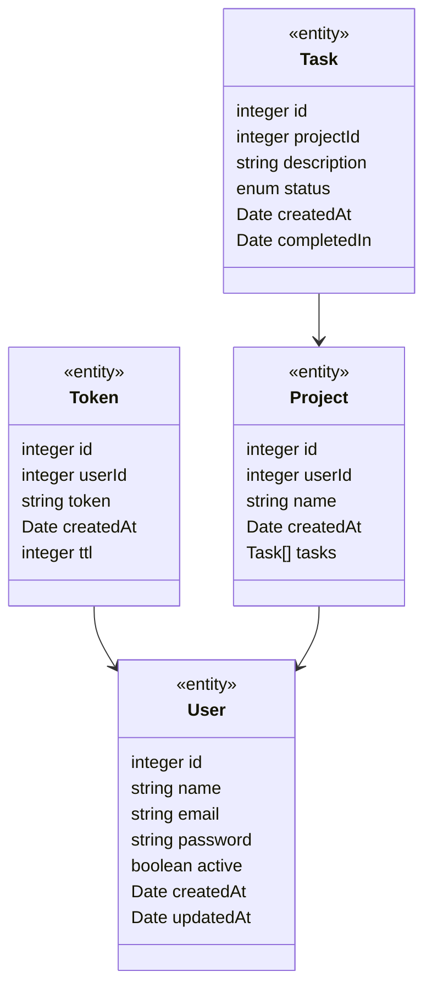

# Bolttech Tasks API

This is a multi-user task manager API by Bolttech.

## Install

```sh
docker-compose up -d
npm i
npm run db:migration:run
npm run db:seed

# Production mode
npm start

# Development mode
npm run dev
```

## Test

```sh
# Unit tests
npm test

# Integration tests
npm run test:integration
```

## Data modeling



## Tools

- [Swagger](http://localhost:3001/api-docs);
- [Adminer](http://localhost:8080/?server=db&username=root&db=bolttech_tasks);
- [OpenAPI Contract](http://localhost:3001/api-contract);
- [SMTP Email](https://app.debugmail.io/app/teams/herbertscruz/projects/bolttech);

## Deploy

## Others

- You might want to use Swagger to do API tests. To get a user token, run the command below in the terminal.

```sh
npm run generate:token
```

- You may want to change the default settings for your application locally or in some environment. All environment variables are available in a `.env.example` file that can be renamed as possible in the [dotenv library](https://www.npmjs.com/package/dotenv).

## Backlog

- Implement email confirmation
- Implement project pagination
- Implement validation and filter endpoint data
- Implement token destruction
- Implement integration tests
